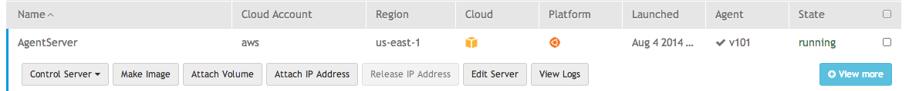

Add a UNIX user
==================

When a dcm-agent is connected to the Dell Cloud Manager it provides many
additional features.  One feature is the ability to add system users to the
running server.  Once added new users can ssh into the running virtual machine.

To add a new user
-------------------

Find your server in the list of deployed servers and click on its row.  This
will cause a new set of buttons to be displayed like the ones shown below.

Click on *Edit Server*.  This will bring you to a screen similar to the one
below:

.. image:: ./images/agent_user_management.png

Select the user name that you want to add and the level of access and click
*Grant Access*.  This will add the user name to the list below.  Take note of
the login name.  In the above example the login name is *p1*.  Now click on
*Update server*.  In a short period of time you will be able to ssh into that
server under the user name of *p001*.
