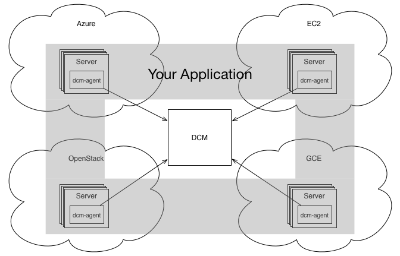

Agent Introduction
=====================================

The dcm-agent is a lightweight service that runs inside of your VM.  When the
VM is booted and the dcm-agent starts it forms a secure communication channel
back to the Dell Cloud Manager.  Commands are sent to the dcm-agent along this
channel.  From simple tasks like adding and removing users on a single VM to
the coordination of multiple VMs in a distributed cloud application, the
dcm-agent can greatly add to the power of the Dell Cloud Manager.

In this architecture the Dell Cloud Manager becomes the conductor and every VM
with a configured dcm-agent provides power for whatever you need orchestrated.
With infrastructure cloud computing each VM can be quite powerful and the total
number of VMs is pragmatically limitless. The hard part is coordinating all of
these pieces to perform in cadence.  The Dell Cloud Manager and dcm-agent
provide the instrumentation to make this possible.

.. toctree::
   :maxdepth: 1
   :includehidden:

   install/agent_installation
   console
   add_users
   troubleshooting
   architecture

