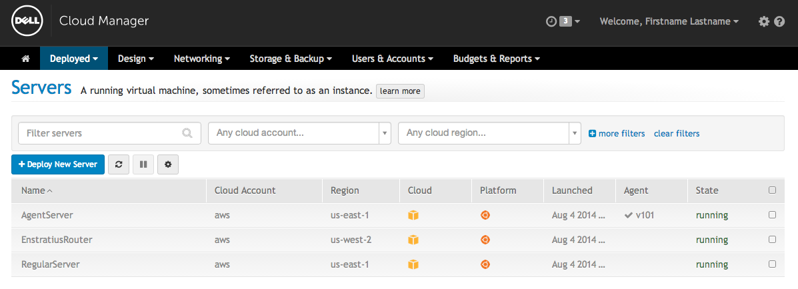

Console Interactions
=====================

With the Dell Cloud Manager you can launch servers on any configured cloud via
the console.  How to do this is described <a href="/docs/compute">here</a>.
Once the agent is installed and started in a server that the console recognizes
that agent will perform a handshake with the Dell Cloud Manager.  Servers that
have successfully completed the handshake will appear in the list of servers
with their dcm-agent version number as shown below.

Note the difference between *AgentServer*, a server with a connected dcm-agent,
and *RegularServer* a server with no dcm-agent.  The first has the *v101* in
the Agent column.  This agent version will vary with the latest DCM agent.
